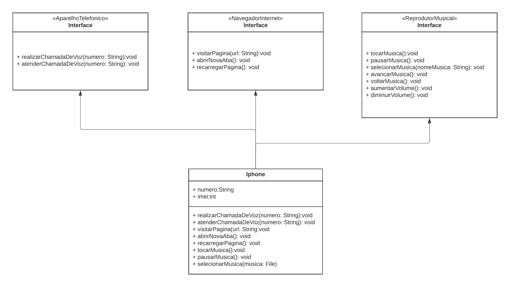

# Diagramação de classes do iPhone

Tarefa desenvolvida como parte do desafio de uma certificação da DIO (Digital Innovation One).

## 📊 Diagrama UML

  

### `iPhone`

A classe `iPhone` é a classe principal que representa o dispositivo. Ela implementa as interfaces `ReprodutorMusical`, `AparelhoTelefonico` e `NavegadorInternet`.

### `ReprodutorMusical`

A interface `ReprodutorMusical` define os métodos necessários para controlar a reprodução de música, `tocarMusica()`, `pausarMusica()`, `avancarMusica()`, `voltarMusica()`, `aumentarVolume()`, `diminuirVolume()` e `selecionarMusica()`.

### `AparelhoTelefonico`

A interface `AparelhoTelefonico` define os métodos para realizar chamadas telefônicas, `realizarChamadaDeVoz()`, `atenderChamadaDeVoz()`.

### `NavegadorInternet`

A interface `NavegadorInternet` define métodos para a navegação na web, como `abrirNovaAba()`, `visitarPagina()` e `recarregarPagina()`.

## 💡 Como usar
Clone o repositório em sua máquina local usando o comando `git clone` e abra a pasta criada como um projeto em sua IDE de preferência.
